# 勤怠管理システム ER図

## エンティティ関係図

```mermaid
erDiagram
    USERS {
        INTEGER id PK
        VARCHAR name
        VARCHAR email UK
        DATETIME email_verified_at
        VARCHAR password
        VARCHAR remember_token
        DATETIME created_at
        DATETIME updated_at
        TINYINT is_admin
        TEXT two_factor_secret
        TEXT two_factor_recovery_codes
        DATETIME two_factor_confirmed_at
    }

    ATTENDANCES {
        INTEGER id PK
        INTEGER user_id FK
        DATE work_date
        TIME clock_in
        TIME clock_out
        TIME break_start
        TIME break_end
        INTEGER total_work_time
        INTEGER total_break_time
        TEXT notes
        DATETIME created_at
        DATETIME updated_at
    }

    BREAK_TIMES {
        INTEGER id PK
        INTEGER attendance_id FK
        TIME start_time
        TIME end_time
        INTEGER order
        DATETIME created_at
        DATETIME updated_at
    }

    STAMP_CORRECTION_REQUESTS {
        INTEGER id PK
        INTEGER user_id FK
        INTEGER attendance_id FK
        VARCHAR request_type
        TIME original_time
        TIME requested_time
        TEXT reason
        VARCHAR status
        TEXT admin_comment
        DATETIME approved_at
        INTEGER approved_by FK
        DATETIME created_at
        DATETIME updated_at
    }

    PASSWORD_RESET_TOKENS {
        VARCHAR email PK
        VARCHAR token
        DATETIME created_at
    }

    MIGRATIONS {
        INTEGER id PK
        VARCHAR migration
        INTEGER batch
    }

    %% リレーションシップ
    USERS ||--o{ ATTENDANCES : "has many"
    USERS ||--o{ STAMP_CORRECTION_REQUESTS : "submits"
    USERS ||--o{ STAMP_CORRECTION_REQUESTS : "approves"
    ATTENDANCES ||--o{ BREAK_TIMES : "has many"
    ATTENDANCES ||--o{ STAMP_CORRECTION_REQUESTS : "has corrections"
```



## テーブル詳細

### 🔑 主要エンティティ

#### **USERS（ユーザー）**
- **役割**: システム利用者（一般ユーザー・管理者）
- **主キー**: `id`
- **ユニークキー**: `email`
- **特徴**: `is_admin`フラグで権限管理

#### **ATTENDANCES（勤怠記録）**
- **役割**: 日次勤怠データ
- **主キー**: `id`
- **ユニークキー**: `user_id + work_date`（1ユーザー1日1レコード）
- **特徴**: 出勤・退勤・総勤務時間を管理

#### **BREAK_TIMES（休憩時間）**
- **役割**: 複数回の休憩記録
- **主キー**: `id`
- **特徴**: `order`で休憩順序を管理、`end_time`nullable（休憩中状態）

#### **STAMP_CORRECTION_REQUESTS（修正申請）**
- **役割**: 勤怠修正のワークフロー管理
- **主キー**: `id`
- **特徴**: 承認待ち・承認済みステータス管理

### 🔗 リレーションシップ

#### **1対多の関係**
- `USERS` → `ATTENDANCES` (1:N)
- `USERS` → `STAMP_CORRECTION_REQUESTS` (申請者, 1:N)
- `USERS` → `STAMP_CORRECTION_REQUESTS` (承認者, 1:N)
- `ATTENDANCES` → `BREAK_TIMES` (1:N)
- `ATTENDANCES` → `STAMP_CORRECTION_REQUESTS` (1:N)

#### **参照整合性**
- `attendances.user_id` → `users.id`
- `break_times.attendance_id` → `attendances.id`
- `stamp_correction_requests.user_id` → `users.id`
- `stamp_correction_requests.attendance_id` → `attendances.id`
- `stamp_correction_requests.approved_by` → `users.id`

### 📊 カーディナリティ

```
USER (1) ←→ (N) ATTENDANCE (1) ←→ (N) BREAK_TIME
  ↓
  (1) ←→ (N) STAMP_CORRECTION_REQUEST ←→ (N) ATTENDANCE
```

### 🎯 ビジネスルール

1. **1ユーザー1日1勤怠**: `attendances(user_id, work_date)`のユニーク制約
2. **複数休憩対応**: `break_times`で1勤怠に対し複数の休憩を記録
3. **承認ワークフロー**: `stamp_correction_requests`で修正申請→承認の流れ
4. **権限管理**: `users.is_admin`で一般ユーザーと管理者を区別
5. **セルフリファレンス**: `stamp_correction_requests.approved_by`で承認者を記録

## システムテーブル

### **PASSWORD_RESET_TOKENS**
- パスワードリセット機能用
- 独立したテーブル（他テーブルとの関係なし）

### **MIGRATIONS**
- Laravel マイグレーション履歴
- システム管理用テーブル
