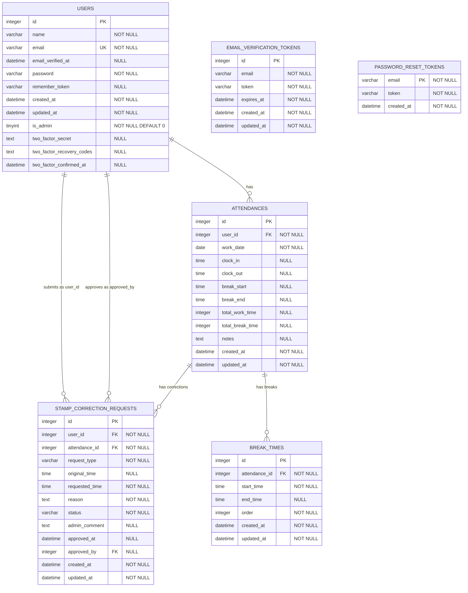

# ER図 - 勤怠管理システム

## Mermaid ER図



## テーブル関係図（テキスト形式）

```
┌─────────────────────────────────────────────────────────────────────────────┐
│                           勤怠管理システム ER図                              │
└─────────────────────────────────────────────────────────────────────────────┘

┌─────────────────────────┐
│        USERS            │
├─────────────────────────┤
│ id (PK)                 │
│ name                    │
│ email (UK)              │
│ email_verified_at       │
│ password                │
│ remember_token          │
│ is_admin                │
│ two_factor_secret       │
│ two_factor_recovery_... │
│ two_factor_confirmed_at │
│ created_at              │
│ updated_at              │
└─────────────────────────┘
           │
           │ 1:N (has)
           ▼
┌─────────────────────────┐
│      ATTENDANCES        │
├─────────────────────────┤
│ id (PK)                 │
│ user_id (FK)            │
│ work_date (UK)          │
│ clock_in                │
│ clock_out               │
│ break_start             │
│ break_end               │
│ total_work_time         │
│ total_break_time        │
│ notes                   │
│ created_at              │
│ updated_at              │
└─────────────────────────┘
           │
           ├─────────────────────────────────┐
           │ 1:N (has breaks)                │ 1:N (has corrections)
           ▼                                 ▼
┌─────────────────────────┐    ┌─────────────────────────────────┐
│      BREAK_TIMES        │    │   STAMP_CORRECTION_REQUESTS     │
├─────────────────────────┤    ├─────────────────────────────────┤
│ id (PK)                 │    │ id (PK)                         │
│ attendance_id (FK)      │    │ user_id (FK) ──────────────────┐│
│ start_time              │    │ attendance_id (FK)              ││
│ end_time                │    │ request_type                    ││
│ order                   │    │ original_time                   ││
│ created_at              │    │ requested_time                  ││
│ updated_at              │    │ reason                          ││
└─────────────────────────┘    │ status                          ││
                               │ admin_comment                   ││
                               │ approved_at                     ││
                               │ approved_by (FK) ───────────────┘│
                               │ created_at                       │
                               │ updated_at                       │
                               └─────────────────────────────────┘

┌─────────────────────────────────┐    ┌─────────────────────────────────┐
│   EMAIL_VERIFICATION_TOKENS     │    │     PASSWORD_RESET_TOKENS       │
├─────────────────────────────────┤    ├─────────────────────────────────┤
│ id (PK)                         │    │ email (PK)                      │
│ email                           │    │ token                           │
│ token                           │    │ created_at                      │
│ expires_at                      │    └─────────────────────────────────┘
│ created_at                      │
│ updated_at                      │
└─────────────────────────────────┘
```

## リレーションシップ詳細

### 1. USERS → ATTENDANCES (1:N)
- **関係**: 1人のユーザーは複数の勤怠記録を持つ
- **外部キー**: attendances.user_id → users.id
- **制約**: user_id + work_date でユニーク（1日1勤怠記録）

### 2. ATTENDANCES → BREAK_TIMES (1:N)
- **関係**: 1つの勤怠記録は複数の休憩時間を持つ
- **外部キー**: break_times.attendance_id → attendances.id
- **特徴**: orderカラムで休憩の順序を管理

### 3. USERS → STAMP_CORRECTION_REQUESTS (1:N) - 申請者
- **関係**: 1人のユーザーは複数の修正申請を提出できる
- **外部キー**: stamp_correction_requests.user_id → users.id

### 4. USERS → STAMP_CORRECTION_REQUESTS (1:N) - 承認者
- **関係**: 1人の管理者は複数の修正申請を承認できる
- **外部キー**: stamp_correction_requests.approved_by → users.id
- **特徴**: NULLable（未承認の場合）

### 5. ATTENDANCES → STAMP_CORRECTION_REQUESTS (1:N)
- **関係**: 1つの勤怠記録は複数の修正申請を持てる
- **外部キー**: stamp_correction_requests.attendance_id → attendances.id

### 6. 独立テーブル
- **EMAIL_VERIFICATION_TOKENS**: カスタムメール認証用
- **PASSWORD_RESET_TOKENS**: パスワードリセット用

## 主要な制約

### UNIQUE制約
1. **users.email** - メールアドレスの重複防止
2. **attendances(user_id, work_date)** - 1日1人1勤怠記録
3. **password_reset_tokens.email** - 1メールアドレス1トークン

### NOT NULL制約
- **必須フィールド**: id, name, email, password, is_admin (users)
- **必須フィールド**: id, user_id, work_date (attendances)
- **必須フィールド**: id, attendance_id, start_time, order (break_times)
- **必須フィールド**: id, user_id, attendance_id, request_type, requested_time, reason, status (stamp_correction_requests)

### 外部キー制約
- **CASCADE DELETE**: 親レコード削除時の子レコード処理
- **RESTRICT**: 参照整合性の保持

## ビジネスルール

1. **勤怠記録**: 1日1人1レコード、複数休憩対応
2. **修正申請**: 承認フロー付き、管理者承認必須
3. **休憩時間**: 動的な複数休憩、順序管理
4. **認証**: カスタムメール認証、2FA対応
5. **権限**: 一般ユーザー・管理者の2段階
